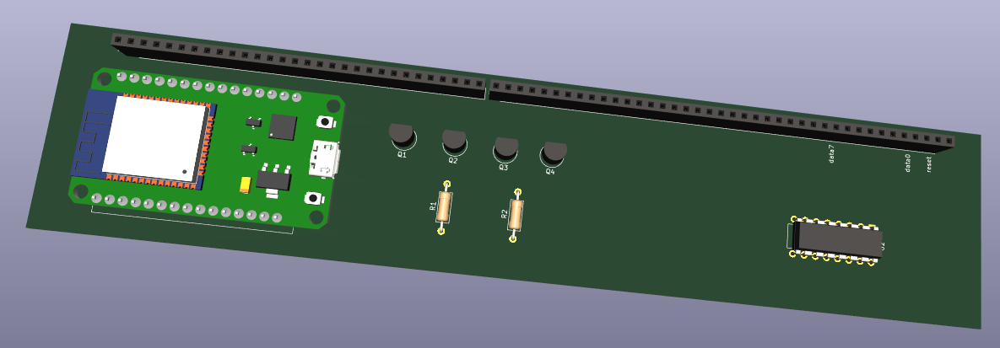

# Make 8 Bit Blink

This is a program loader for [Ben Eater's 8 bit computer](https://eater.net/8bit/).  This is a work in progress.



# BOM

| Item                   | Link                   |
|------------------------|------------------------|
| ESP32                  | https://a.co/d/88cG9Z5 |
| 74HC595 Shift Register | https://a.co/d/fSzBLRR |
| PN2222 Transistors     | https://a.co/d/9t9HXHG |
| 40pin Socket Headers   | https://a.co/d/aSeVX48 |
| 22awg Hookup Wire      | https://a.co/d/aD9MhwA |


# Overview

The ESP32 polls the api (`/run` endpoint) for programs periodically.  If a program is in a queue the loader hatls the computer and loads the program.

# API

The api can by running `docker compose up` in the api directory.

Programs are queued in the order they are received.  A program can be queued by POSTing to the `/program` endpoint with the following JSON structure.

```json
{
    "clockSpeed": 100,
    "time": 20,
    "name": "42",
    "memory": [
        {
            "address": 14,
            "value": 28
        },
        {
            "address": 15,
            "value": 14
        }
    ],
    "instructions": [
        {
            "name": "LDA",
            "argument": 14
        },
        {
            "name": "ADD",
            "argument": 15
        },
        {
            "name": "OUT",
            "argument": 0
        },
        {
            "name": "HLT",
            "argument": 0
        }
    ]
}
```